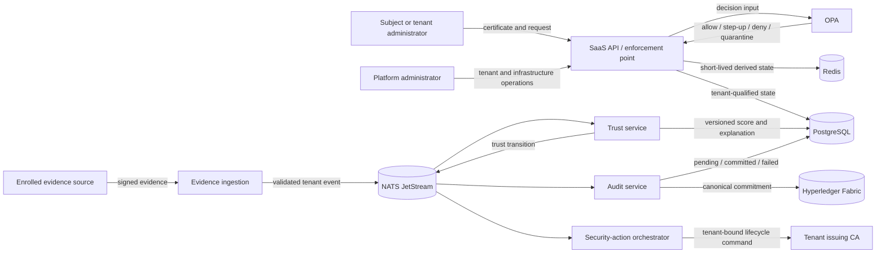

# Threat model and failure policy

This document defines the security assumptions and required failure behavior for the Tenant Trust research prototype. It describes architecture and threat hypotheses; it does not report validated vulnerabilities. Controls described as **required** are design requirements for later tasks unless repository evidence identifies them as already implemented.

## 1. Overview

Tenant Trust is a local multi-tenant SaaS prototype. A request must pass certificate validation, tenant and subject binding, role and resource checks, request-context checks, and an OPA policy decision that includes current trust. Signed evidence feeds an explainable trust engine. Decisions may trigger governed security or certificate actions. Selected event commitments will be delivered asynchronously to a private Hyperledger Fabric network while raw evidence remains off-chain (`docs/scope.md:3-5`, `docs/scope.md:30-38`, `docs/scope.md:40-58`).

The demonstration uses two synthetic tenants with separate members, records, issuers, evidence sources, trust settings, and policy versions. A platform administrator operates shared infrastructure but does not automatically gain access to tenant records (`docs/scope.md:7-15`).

### Components and evidence

| Component | Security responsibility | Current status and source |
| --- | --- | --- |
| Browser dashboard | Presents tenant data, trust explanations, certificate controls, and audit views through the protected API | Planned boundary (`docs/architecture/repository-layout.md:5-9`) |
| SaaS API | Authenticates requests and enforces tenant, subject, role, resource, context, certificate, and policy decisions | Planned boundary (`docs/architecture/repository-layout.md:7-8`, `docs/architecture/repository-layout.md:26-32`) |
| Evidence service | Enrolls sources; validates signature, freshness, sequence, subject, and tenant before publishing accepted evidence | Planned boundary (`docs/architecture/repository-layout.md:9-10`, `packages/contracts/README.md:34-43`) |
| Trust service | Computes versioned scores, smoothing, state transitions, and explanations from accepted evidence | Planned boundary (`docs/architecture/repository-layout.md:10-10`, `packages/contracts/schemas/events/trust-event.schema.json:17-27`) |
| OPA | Evaluates versioned authorization policy; application callers are intended to use documented decision paths | Bootstrap service is running; access policy is not implemented (`policies/README.md:3-5`, `infra/compose/compose.yaml:99-118`) |
| Orchestrator | Applies idempotent restrictions, revocations, replacements, and governed recovery | Planned boundary (`docs/architecture/repository-layout.md:11-12`, `packages/contracts/schemas/events/action-event.schema.json:17-25`) |
| Tenant PKI | Issues, renews, rotates, and revokes tenant-bound X.509 identities | One development CA is running; separate tenant issuers are a future gate (`docs/architecture/tenant-pki.md:1-9`, `docs/architecture/tenant-pki.md:21-29`) |
| PostgreSQL | Owns durable identity, tenant resources, trust, policy, action, audit-projection, outbox, and idempotency state | Identity and sample resource tables use forced row-level security with transaction-local tenant and subject binding, live membership/role checks and owner/admin resource rules; later domain tables must add the same controls (`database/migrations/003_tenant_row_level_security.sql`, `database/migrations/004_tenant_resources_and_membership_rules.sql`) |
| Redis | Holds short-lived derived state and invalidation data; it is not an authority for identity or access | Bootstrap persistence and authentication exist (`infra/compose/compose.yaml:24-50`) |
| NATS JetStream | Delivers tenant-scoped events with durable storage, explicit acknowledgement, retry, and replay | Foundation delivery is implemented (`docs/architecture/event-delivery.md:1-15`, `docs/architecture/event-delivery.md:17-32`) |
| Audit service and Fabric | Canonicalizes selected records, submits commitments, confirms ledger commits, reconciles failures, and verifies off-chain data | Planned and not yet running (`docs/architecture/repository-layout.md:12-19`, `docs/scope.md:52-58`) |

The diagram is the intended architecture. Only PostgreSQL, Redis, NATS, one development step-ca instance, and an OPA bootstrap package currently run.

### Effective resources and current enforcement

| Deployment or workflow | Resource or capability | Configuration and precedence | Safe effective value or location | Readers, writers, or recipients | Enforcing control | Evidence or unknowns |
| --- | --- | --- | --- | --- | --- | --- |
| Local core stack | PostgreSQL, Redis, NATS, step-ca, and OPA listeners | `.env` supplies images, credentials, and host ports to Compose | Loopback host bindings; shared `tenant-trust-backend` Docker network | Host processes and containers on the shared network | Local credentials on PostgreSQL, Redis, and NATS; loopback host exposure | Ports and shared network are explicit (`infra/compose/compose.yaml:1-22`, `infra/compose/compose.yaml:24-73`, `infra/compose/compose.yaml:75-119`). Container-to-container authorization is not yet service-specific. |
| Local database and event broker | Service credentials | Generated `.env` overrides safe placeholders; `.env` is ignored | Ignored repository-root `.env`; literal values must never enter logs or documentation | Compose and local verification scripts | Generated values, requested mode `0600`, service authentication, and exact tenant NATS subject grants | The local stack uses one PostgreSQL account, one Redis password, a privileged NATS service account, and two fixed demonstration tenant accounts. Windows permission-change errors are tolerated and no Windows ACL check proves which local principals can read the file. The NATS tenant grants are a broker boundary; the remaining credentials are platform-development controls (`scripts/init-local-env.mjs`, `infra/compose/compose.yaml`, `infra/nats/nats-server.conf`). |
| Local CA bootstrap | CA password and issuing-key state | Compose secret file unlocks the CA key in the named volume | Ignored `runtime/secrets/step-ca-password.txt`; `tenant-trust-step-ca-data` volume | step-ca and the one-shot initializer | Ignored secret file, encrypted key, Docker mount, local host access | The running CA proves issuance only. It does not prove per-tenant issuer isolation (`infra/compose/compose.yaml:75-95`, `infra/compose/compose.yaml:121-135`, `docs/architecture/tenant-pki.md:1-9`). |
| OPA bootstrap | Policy source and decision API | Repository policy directory is mounted read-only; OPA listens on the backend network and loopback host port | `policies/` and OPA Data API | API/worker containers and local host processes | Read-only source mount and later application-side caller restrictions | No service authentication or network policy is configured for OPA in the bootstrap Compose file. The current trust assumption is the local host and backend network (`infra/compose/compose.yaml:99-119`, `policies/README.md:3-5`). |
| Event delivery | Tenant events and durable consumer state | Context-bound subject and consumer helpers; one stream covers `tenant.*.events.>` | `tenant-trust-nats-data` named volume | Privileged platform worker or a tenant credential restricted to one exact prefix | Resolver-branded context, envelope mismatch rejection, constructed tenant filter, broker grants, schema and idempotency checks | Unit and live checks prove Alpha/Beta separation. The privileged service account can span tenants, so credential placement and application envelope-to-state validation remain required (`packages/messaging/src/index.mjs`, `infra/nats/nats-server.conf`, `scripts/verify-runtime-isolation.mjs`). |
| Tenant security configuration | Issuer mappings, evidence sources, trust settings and policy versions | Tenant-qualified PostgreSQL rows with immutable version content and actor-aware forced RLS | `identity.tenant_issuer_mappings` and `trust` configuration tables | Active tenant members read; active tenant administrators manage | Composite tenant keys, same-tenant foreign keys, one-active-version constraints and transaction-local actor context | Isolation and connection-reuse tests pass. Issuers and sources remain planned metadata, the trust engine is not implemented, and published policy metadata is not an active OPA decision bundle (`docs/architecture/tenant-security-configuration.md`). |
| Planned audit workflow | Raw evidence, canonical record, and ledger commitment | Raw evidence stays tenant-scoped off-chain; only canonical hashes and minimal anchors go to Fabric | PostgreSQL/object storage location is not yet selected; Fabric topology is not yet implemented | Evidence/trust/decision owners, audit worker, Fabric peers | Canonicalization, authenticated submission, commit confirmation, reconciliation | Canonical byte encoding, Fabric membership, endorsement, and private-data rules remain open (`packages/contracts/README.md:24-32`, `docs/scope.md:52-58`, `docs/scope.md:80-82`). |

## 2. Threat Model, Trust Boundaries, and Assumptions

### Protected assets

- Tenant records and metadata, including the fact that a record or subject exists.
- Tenant membership, roles, ownership, suspension state, and issuer mapping.
- Root and intermediate private keys, CA provisioner credentials, certificate status, and revocation authority.
- Evidence-source keys, accepted evidence bytes, freshness and sequence state, and source reputation or influence limits.
- Trust inputs, scores, bands, explanations, model versions, configuration versions, and recovery state.
- Policy source, published bundle, activation state, version identity, and the exact decision input/output.
- Idempotency receipts, causal identifiers, security-action state, and session invalidation state.
- Off-chain audit records, canonicalization rules, hashes, Fabric identities, ledger commitments, and commit status.
- Availability needed to deny unsafe access, process revocations, preserve durable events, and reconcile audit commitments.

### Actors and attacker capabilities

| Actor | Realistic starting capability | Authority not assumed |
| --- | --- | --- |
| Malicious tenant member | Has a valid certificate and can control request parameters, resource identifiers, timing, and permitted tenant data | Another tenant's membership, issuer, records, policy, evidence source, or administrative role |
| Compromised tenant administrator | Can perform allowed administration inside one tenant and may possess that tenant's ordinary admin credentials | Platform root key, another tenant's issuer/provisioner, platform infrastructure control, or unrestricted record access |
| Compromised evidence source | Can sign syntactically valid statements as one enrolled source and choose their content/timing within reachable checks | Other source keys, tenant administration, trust-model configuration, or policy activation |
| Network or browser attacker | Can send malformed/replayed requests and may control browser-origin input or an untrusted network segment in a future deployment | Valid private keys, service credentials, host access, or trusted TLS termination |
| Compromised application component | Has the service credentials and network reach explicitly assigned to that component | Automatic authority over every tenant, CA, policy, database schema, or Fabric identity |
| Platform operator | Controls the development host and shared infrastructure configuration | Automatic business authorization to tenant records; the role separation is a design invariant (`docs/scope.md:11-15`) |
| Development-host attacker | Can read local files, Docker volumes, process memory, and network traffic after obtaining the user's OS/Docker authority | This is outside the prototype's isolation claim; the single-machine deployment cannot protect local secrets from a fully compromised host |

### Trust boundaries

| Boundary crossing | Data or authority transferred | Required controls and invariant | Source evidence |
| --- | --- | --- | --- |
| Browser/client to API | Certificate, request, tenant resource reference, context, and optional step-up proof | Derive tenant and subject from validated authentication; validate the request; bind proof to tenant, subject, session, operation, and request; never accept caller-selected tenant authority | `docs/scope.md:17-28`, `docs/scope.md:46-50`, `docs/architecture/repository-layout.md:26-32` |
| API to PostgreSQL/Redis | Tenant-qualified reads/writes and derived cache state | Every durable query and cache key carries trusted tenant scope; database isolation remains the backstop; cache absence or corruption never becomes an allow | `docs/architecture/repository-layout.md:26-32`, `docs/architecture/technology-stack.md:14-18` |
| Evidence source to ingestion | Signed statement, source ID, tenant, subject, timestamps, sequence, and content | Verify enrolled key and algorithm, tenant/subject binding, freshness, expiry, monotonic sequence, size/rate, and schema before acceptance; a valid signature proves origin, not truth | `docs/scope.md:40-44`, `packages/contracts/schemas/events/evidence-event.schema.json:17-28`, `packages/contracts/README.md:34-43` |
| Producer/consumer to NATS | Versioned tenant event and delivery acknowledgement | Validate before publish and before effect; derive subject from validated envelope; bind envelope to trusted aggregate; make effects idempotent; acknowledge only after the durable effect | `docs/architecture/event-delivery.md:5-15`, `docs/architecture/event-delivery.md:17-28`, `packages/contracts/README.md:26-43` |
| Trust service to durable state and OPA input | Score, band, evidence references, explanation hash, and version identifiers | Compute deterministically from accepted, non-expired evidence; bound source influence and recovery; use concurrency control; persist exact model/config version and explanation | `docs/scope.md:40-50`, `packages/contracts/schemas/events/trust-event.schema.json:17-27` |
| API to OPA | Authenticated identity, tenant, role, resource, operation, context, certificate status, trust, and policy version | Complete input is mandatory; unknown or malformed decisions deny; only an activated, integrity-checked policy version may decide; trust never overrides identity or tenant checks | `README.md:3-5`, `packages/contracts/schemas/events/decision-event.schema.json:17-30`, `policies/README.md:3-5` |
| Orchestrator to tenant CA | Tenant-bound issue, renewal, rotation, or revocation authority | Resolve issuer from trusted tenant state; use tenant-specific credentials; require idempotency and explicit action state; never restore a revoked certificate | `docs/architecture/tenant-pki.md:11-29`, `docs/scope.md:30-38` |
| Audit worker to Fabric | Canonical hash commitment, causal identifiers, submitter identity, and commit status | Keep raw evidence off-chain; bind channel/chaincode/organization and record identity; verify endorsement and commit; record pending/failed honestly; reconcile retries idempotently | `docs/scope.md:52-58`, `packages/contracts/README.md:24-32`, `packages/contracts/README.md:67-67` |
| Repository/operator to running services | Images, policy, trust configuration, migrations, secrets, and deployment topology | Review and version non-secret inputs; pin artifacts; separate duties for production changes; never commit generated keys or credentials | `docs/architecture/technology-stack.md:26-30`, `docs/architecture/repository-layout.md:35-39` |

### Security objectives and invariants

1. **Tenant isolation:** an authenticated actor, event, cache key, query, certificate action, policy, or audit record for tenant A cannot read or change tenant B state.
2. **Credential precedence:** invalid, expired, revoked, unknown, or foreign-tenant credentials deny access regardless of trust score (`docs/scope.md:30-38`).
3. **No score-only authorization:** every allow requires current membership, role/resource authorization, trusted request context, acceptable certificate state, an activated policy, and acceptable trust.
4. **Evidence authenticity and bounded truth:** accept evidence only from an enrolled tenant-bound source after signature, freshness, expiry, sequence, schema, and replay checks. Limit any one source's ability to raise or lower trust. A signature is not a truth oracle (`docs/scope.md:40-44`).
5. **Deterministic, explainable trust:** store the inputs, model/configuration version, transition, and explanation reference for every security-relevant score change (`packages/contracts/schemas/events/trust-event.schema.json:17-27`).
6. **Fail-closed authorization:** missing identity, tenant state, certificate status, policy, trust state, or authoritative durable data cannot produce `ALLOW`.
7. **Controlled irreversible action:** restriction may be immediate and reversible; certificate revocation requires explicit severity, corroboration, idempotency, and durable action state. A revoked certificate is never reactivated (`docs/scope.md:34-38`, `docs/scope.md:48-50`).
8. **Causal and idempotent processing:** retries or replay cannot apply a state change or irreversible action twice. Conflicting reuse of an event or idempotency identity is rejected and audited (`packages/contracts/README.md:24-32`).
9. **Honest audit status:** a submission is not `committed` until Fabric commit confirmation succeeds. Ledger failure never silently discards the off-chain record or fabricates verification (`docs/scope.md:54-58`).
10. **Privacy minimization:** raw evidence, direct resource identifiers, secrets, and private keys stay off-chain and out of ordinary logs; ledger records contain canonical commitments and the minimum verification metadata.

### Required runtime failure decisions

| Failure or uncertainty | Required runtime decision | Recovery and audit behavior |
| --- | --- | --- |
| Certificate invalid, expired, revoked, unknown, or belongs to another tenant | `DENY` before trust evaluation | Record a tenant-safe reason code; do not disclose whether a foreign resource exists |
| Tenant, subject, membership, role, ownership, or issuer mapping missing or inconsistent | `DENY` | Reconcile authoritative PostgreSQL state; do not infer tenant from request data |
| Trust state missing, corrupt, or `uninitialized` | `DENY` all protected operations in the current prototype | Collect valid evidence and create a new versioned trust state through the normal workflow |
| Required evidence expired or trust snapshot exceeds its configured age | Exclude expired evidence and recompute; if a current decision cannot be produced, `DENY` | Emit the stale/missing reason without automatically revoking the certificate |
| Evidence source unavailable | Keep the last accepted observation only until its recorded expiry; never assume healthy or hostile solely from silence | Mark source availability separately; after expiry, follow the stale-trust rule |
| Evidence signature, tenant/subject binding, time, sequence, schema, or size/rate check fails | Reject the evidence and preserve the last valid trust state until it expires | Publish/record a rejection with a bounded reason code; repeated abuse may reduce source influence or trigger a separate policy |
| OPA unavailable, times out, returns malformed output, or cannot identify an activated policy version | `DENY`; do not reuse an old `ALLOW` for a new request | Report policy dependency failure and keep the exact request/decision correlation for reconciliation |
| Redis unavailable or a cache entry is missing/corrupt | Read authoritative PostgreSQL state; if that cannot complete, `DENY` | Invalidate/rebuild cache after recovery; never treat a cache miss as trusted state |
| PostgreSQL unavailable or a required transaction fails | `DENY` protected and state-changing requests; do not acknowledge dependent events | Retry bounded asynchronous work; preserve unacknowledged messages and surface the failure |
| NATS unavailable during a state-changing command | Commit state and an outbox record atomically only when that path exists; otherwise reject the command rather than create an unauditable partial workflow | Publish the outbox after recovery. Never claim delivery from a plain, unacknowledged publish (`docs/architecture/event-delivery.md:11-15`) |
| Consumer fails before durable effect commits | Do not acknowledge; retry with the same event identity | After bounded retries, persist reconciliation/failure state outside the stream before its seven-day or 512 MiB retention limit can evict the event (`docs/architecture/event-delivery.md:7-9`, `docs/architecture/event-delivery.md:17-28`) |
| Tenant CA unavailable | Block issuance and renewal. Continue existing-certificate authorization only when current certificate status and all other decision inputs are authoritative | Keep lifecycle request pending/failed with no certificate issued |
| Revocation requested but CA execution is pending or fails | Immediately restrict application access for the target subject/certificate; never report the certificate revoked until CA confirmation | Retry idempotently, alert for reconciliation, and retain both requested and failed/succeeded action states |
| Orchestrator restarts during an action | Do not repeat an irreversible effect until the stored action identity and target state are reconciled | Resume from durable requested state; duplicate success is acknowledged without a second effect |
| Fabric unavailable, rejects endorsement, or commit confirmation is unknown | Runtime authorization continues from authoritative off-chain state; audit record stays `pending` or `failed`, never `committed` | Retry through durable delivery, query commit status, and reconcile after recovery (`docs/scope.md:67-70`) |
| System time is outside the allowed skew or unavailable | Reject fresh-evidence acceptance and time-sensitive authentication/authorization | Restore trusted time, then re-evaluate; never rewrite historical timestamps |
| Resource limit reached or a source floods inputs | Apply per-source and per-tenant bounds; reject or defer excess work without evicting another tenant's durable state | Record bounded metrics and a failure reason; preserve isolation and recovery capacity |

### Assumptions, exclusions, and open questions

- The current deployment is a single-developer, single-host research environment. Docker/Windows administrator compromise defeats local file, volume, process, and network secrecy. Production host hardening, separate operator accounts, HSM/KMS integration, and high availability are outside the demonstrated boundary.
- All tenant data and identities are synthetic. The prototype does not establish production privacy compliance, commercial certification, hardware device attestation, or a trained machine-learning model (`docs/scope.md:72-78`).
- The current CA, backend network, PostgreSQL account, Redis password, and privileged NATS service account are shared local infrastructure. Tenant-specific NATS accounts prove exact subject enforcement for the two synthetic tenants, but production still requires service-specific identities, protected credential distribution and network segmentation.
- The environment initializer requests mode `0600`, but it tolerates permission-change failures on Windows and does not verify an access-control list. Git ignore rules prevent accidental staging; they do not restrict another local principal or Docker administrator (`scripts/init-local-env.mjs:56-76`).
- NATS retention is bounded to seven days and 512 MiB with discard-old behavior. Durable failure/reconciliation records must therefore survive outside JetStream; the stream alone is not an indefinite security-event archive (`docs/architecture/event-delivery.md:7-9`, `packages/messaging/src/index.mjs:19-31`).
- The current OPA package is a health/bootstrap policy and makes no access decision (`policies/README.md:3-5`). Policy authenticity, activation, rollback, separation of duties, and decision-input completeness remain implementation gates.
- The exact second factor, certificate-status distribution mechanism, trust thresholds/hysteresis, canonical audit byte format, Fabric organizations/channel/endorsement policy, and reporting deadline remain open (`docs/scope.md:80-82`).
- Planned evidence source rows now have stable tenant-owned IDs, verification methods, freshness bounds and source-influence configuration. Key enrollment, rotation, compromise response and rate enforcement still need implementation and tests.
- PostgreSQL now enforces tenant-qualified identity, sample-resource and security-configuration access through a constrained runtime role and forced row-level security. Future domain tables remain unprotected until their migrations apply equivalent tenant, actor, ownership and role policies with negative tests.
- Fabric can prove that endorsed bytes were committed under the configured network policy. It cannot prove that originally false evidence was true, that off-chain data was complete, or that independent organizations controlled the peers (`docs/scope.md:54-58`).
- Availability policy must distinguish safety from liveness: the system may deny or delay work when it lacks authoritative state, but it must not silently weaken tenant isolation, restore revoked credentials, repeat irreversible actions, or claim an audit commit.

## 3. Attack Surface, Mitigations, and Attacker Stories

The following are prioritized hypotheses for design and testing. They are not confirmed findings.

| Priority | Scenario and capability gain | Prerequisites | Impact | Existing controls | Required mitigation | Evidence |
| --- | --- | --- | --- | --- | --- | --- |
| P0 | A tenant member supplies another tenant's ID, issuer, subject, or resource and a component trusts it, gaining cross-tenant read, write, certificate, or policy authority | Valid credential in one tenant plus an unbound identifier path | Cross-tenant confidentiality/integrity loss | Trusted tenant-context resolver, forced row-level security, actor-bound resources and security configuration, and a combined negative gate for guessed identifiers and connection reuse | Extend the same tenant and actor binding and `npm run cross-tenant:verify` coverage to every future query, key, event, policy and action | `docs/security/cross-tenant-negative-testing.md`, `docs/architecture/tenant-context-resolution.md`, `docs/architecture/database-isolation.md`, `docs/architecture/resource-membership-authorization.md`, `docs/architecture/tenant-security-configuration.md` |
| P0 | Platform root or broadly shared CA provisioner compromise enables certificates for multiple tenants | Online/shared root or reuse of intermediate credentials | Platform-wide identity forgery | Offline-root and per-tenant intermediate design | Keep root offline/HSM-backed; isolate issuer keys and provisioners; constrain intermediates; test one tenant cannot issue/revoke for another | `docs/architecture/tenant-pki.md:5-9`, `docs/architecture/tenant-pki.md:21-29` |
| P1 | A compromised evidence source signs false statements that inflate trust or suppress restriction | Source key compromise or dishonest enrolled source | Unauthorized access with an otherwise valid identity | Signature/freshness/schema design; explicit statement that signature does not prove truth | Per-source influence caps, corroboration, anomaly/rate controls, rapid source disable/rotation, and no single-source irreversible action | `docs/scope.md:40-50` |
| P1 | Replayed, duplicated, or reordered evidence repeatedly changes trust or security-action state | Captured valid evidence/event or consumer redelivery | Trust manipulation, repeated restriction/revocation, inconsistent state | Sequence fields, event IDs, idempotency rules, explicit acknowledgements | Persist source sequence and event receipts with effects; reject conflicting identities; enforce aggregate version/locking and replay tests | `packages/contracts/README.md:26-43`, `docs/architecture/event-delivery.md:17-32` |
| P1 | OPA failure or incomplete input falls back to allow, or a mutable/unapproved policy decides a request | Dependency outage, malformed response, stale bundle, or policy-management access | Authorization bypass across protected operations | OPA is a separate decision boundary; bootstrap policy is read-only from the repository mount | Deny on error/unknown; require a complete typed input and activated policy hash/version; authenticate/restrict policy administration; test outage and rollback | `policies/README.md:3-5`, `packages/contracts/schemas/events/decision-event.schema.json:17-30` |
| P1 | Revocation is delayed while the application continues to accept the certificate | CA outage or asynchronous action failure | Continued access by a subject selected for containment | Separate reversible restriction and permanent revocation states | Apply immediate application restriction, invalidate sessions/cache, persist pending action, retry CA operation idempotently, and verify revocation before success | `docs/scope.md:30-38`, `packages/contracts/schemas/events/action-event.schema.json:17-25` |
| P1 | A stale Redis entry or stale trust snapshot overrides newer membership, certificate, or restriction state | Cache invalidation failure or clock/skew error | Access after removal/revocation or under outdated trust | PostgreSQL is intended durable authority; evidence has expiry fields | Version cache entries; compare critical versions; bound age; invalidate on events; fall back to durable state or deny | `docs/architecture/technology-stack.md:14-18`, `packages/contracts/schemas/events/evidence-event.schema.json:17-28` |
| P1 | A false or duplicated decision triggers a self-amplifying loop of trust reductions and certificate actions | Feedback events treated as new independent evidence | Cascading quarantine/revocation and denial of service | Causal IDs, action IDs, separate requested/succeeded/failed states | Model feedback causality; cap repeated influence; require hysteresis/cooldown/corroboration; make irreversible actions one-way and idempotent | `packages/contracts/README.md:24-32`, `packages/contracts/schemas/events/action-event.schema.json:17-25` |
| P1 | A component writes raw evidence, identifiers, secrets, or private keys into NATS, logs, or Fabric | Overbroad event/log payload or audit canonicalization | Persistent privacy or credential exposure | Event contracts carry hashes; scope says raw evidence stays off-chain | Allowlist audit fields; redact logs; scan fixtures/artifacts; test serialized payloads; segregate encryption keys and retention | `packages/contracts/README.md:67-67`, `docs/architecture/repository-layout.md:35-39` |
| P2 | A producer publishes state change without a committed outbox, or acknowledges before its durable effect, causing missing or inconsistent security state | Crash/network failure between storage and publish/ack | Lost restriction/audit event or divergent services | Documented outbox and acknowledgement ordering requirements | Implement transactional outbox/inbox, idempotent reconciliation, bounded retry, and failure metrics | `docs/architecture/event-delivery.md:11-28` |
| P2 | A local process or compromised peer container reaches shared OPA/NATS/Redis/PostgreSQL interfaces with broad development credentials | Host access or compromise of one backend container | Tampering or lateral movement across local service data | Loopback host bindings and service passwords | Use service-specific identities/permissions, network segmentation, minimum database grants, and authenticated policy distribution before non-local deployment | `infra/compose/compose.yaml:1-73`, `infra/compose/compose.yaml:99-119` |
| P2 | A fabricated or ambiguous Fabric status is shown as committed | Submit timeout, endorsement failure, wrong channel/chaincode, or query ambiguity | False audit assurance and failed later verification | Pending/failed/committed design and commit-confirmation requirement | Bind record ID and expected digest to network/channel/contract; verify transaction validation code; reconcile unknown commits before status changes | `docs/scope.md:52-58`, `docs/scope.md:67-70` |
| P2 | Flooding one evidence source, tenant, or JetStream subject consumes shared capacity and delays another tenant's security events | Valid or invalid high-rate input | Cross-tenant availability loss and delayed containment | Stream has finite retention and one-message default consumer ordering | Per-source/tenant quotas, size limits, bounded queues, fair partitions, backpressure, and retention alarms; never silently discard final failures | `docs/architecture/event-delivery.md:7-9`, `docs/architecture/event-delivery.md:25-28` |
| P2 | A step-up proof is replayed for another request, operation, subject, tenant, or session | Captured proof and insufficient binding | Sensitive export or admin action without current second-factor intent | Decision contract includes a proof hash | Use short expiry and one-time nonce; bind proof to request, tenant, subject, session, operation, resource scope, and policy version | `docs/scope.md:17-28`, `docs/scope.md:46-50` |
| P3 | Error messages reveal that another tenant's resource, subject, or certificate exists | Cross-tenant probing of identifiers | Tenant metadata disclosure | Opaque identifiers reduce direct personal-data leakage | Return uniform denial, restrict reason details to tenant-safe audit, and test timing/status consistency | `packages/contracts/README.md:7-24` |

## 4. Severity Calibration (Critical, High, Medium, Low)

Severity describes the impact if a hypothesis becomes reachable in the implemented system. Confidence remains separate: an unimplemented or unverified path is an open design risk, not a finding.

| Severity | Project-specific examples | Conditions that change the rating | Counterexamples |
| --- | --- | --- | --- |
| Critical | Platform-root key compromise or a remotely reachable control that permits arbitrary certificate/policy issuance across all tenants; unauthenticated platform-wide code execution with service/key access | Requires multi-tenant or platform-wide authority and realistic reachability. Offline/HSM root custody, per-tenant issuer isolation, and lack of a remote path materially reduce likelihood | Compromise of a disposable synthetic leaf certificate for one subject is not Critical |
| High | Cross-tenant record access or modification; another tenant's certificate issuance/revocation; policy bypass that allows sensitive export/admin operations; raw private-key or high-sensitivity evidence disclosure | Falls when the path is limited to a local fully trusted developer host or requires authority the attacker already has. Rises with broad, repeatable remote access | A tenant administrator performing an explicitly authorized action inside the same tenant is expected behavior |
| Medium | Replay causing bounded duplicate processing; delayed restriction or audit commitment with visible failure state; one-tenant availability loss; source manipulation that affects trust but cannot independently authorize or revoke | Strong idempotency, bounded influence, prompt reconciliation, and fail-closed policy reduce impact/likelihood | Fabric outage alone is not an authorization bypass when off-chain enforcement remains authoritative |
| Low | Tenant-existence leakage through inconsistent errors; local diagnostic information without secrets; small bounded resource consumption with automatic recovery | Repeated enumeration, sensitive metadata, or a path that combines with another boundary failure can raise severity | A rejected malformed synthetic request with no durable effect is ordinarily not a security finding |

The following claims are unsupported until later implementation and evaluation: production tenant isolation, resistance to a compromised development host, independence of Fabric operators, real device attestation, calibrated detection accuracy, production availability, and proof that configured trust weights improve security. Passing foundation health checks proves only that the selected local services start and that their narrow bootstrap checks succeed.
